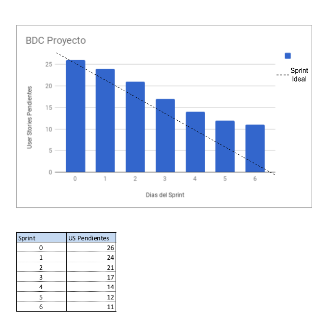

# IISoft-ACDP-Backend

University Proyect of IISoft - UNQ

### Members

Number |       Name              | UNQ-Records |    EMail
-------|-------------------------|-------------|------------------------
1      | Pasquale Gabriel        |    33566    | pasqualeunq@gmail.com
2      | Autalan Fernando Nahuel |    38046    | f.n.autalan@gmail.com
3      | Dominikow Ivan Diego    |    37517    | dominikowivan@gmail.com
4      | Degano Victor           |    26106    | flame.el22@gmail.com

### Visual Story Mapping 

### Burndown Chart

### Sprints

- [Sprint 0][1]
- [Sprint 1][2]
- [Sprint 2][3]
- [Sprint 3][4]
- [Sprint 4][5]
- [Sprint 5][6]
- [Sprint 6][7]

[1]: ./sprints/sprint0/README.md
[2]: ./sprints/sprint1/README.md
[3]: ./sprints/sprint2/README.md
[4]: ./sprints/sprint3/README.md
[5]: ./sprints/sprint4/README.md
[6]: ./sprints/sprint5/README.md
[7]: ./sprints/sprint6/README.md

### Caso de uso

- [Caso de uso][8]

[8]: ./sprints/README.md

